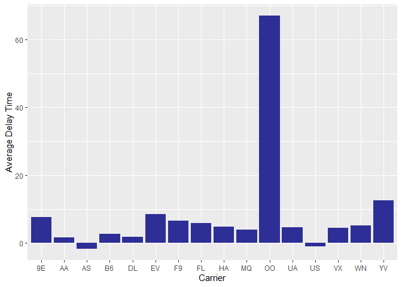
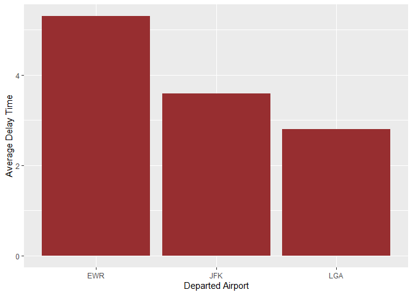
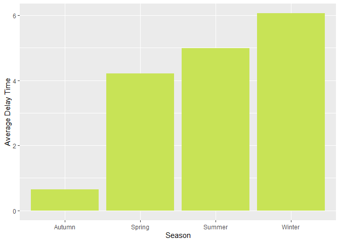

433hw3
================
Yifan Zhang
2/28/2021

``` r
library(dplyr)
```

    ## 
    ## Attaching package: 'dplyr'

    ## The following objects are masked from 'package:stats':
    ## 
    ##     filter, lag

    ## The following objects are masked from 'package:base':
    ## 
    ##     intersect, setdiff, setequal, union

``` r
library(nycflights13)
library(ggplot2)

flights
```

    ## # A tibble: 336,776 x 19
    ##     year month   day dep_time sched_dep_time dep_delay arr_time sched_arr_time
    ##    <int> <int> <int>    <int>          <int>     <dbl>    <int>          <int>
    ##  1  2013     1     1      517            515         2      830            819
    ##  2  2013     1     1      533            529         4      850            830
    ##  3  2013     1     1      542            540         2      923            850
    ##  4  2013     1     1      544            545        -1     1004           1022
    ##  5  2013     1     1      554            600        -6      812            837
    ##  6  2013     1     1      554            558        -4      740            728
    ##  7  2013     1     1      555            600        -5      913            854
    ##  8  2013     1     1      557            600        -3      709            723
    ##  9  2013     1     1      557            600        -3      838            846
    ## 10  2013     1     1      558            600        -2      753            745
    ## # ... with 336,766 more rows, and 11 more variables: arr_delay <dbl>,
    ## #   carrier <chr>, flight <int>, tailnum <chr>, origin <chr>, dest <chr>,
    ## #   air_time <dbl>, distance <dbl>, hour <dbl>, minute <dbl>, time_hour <dttm>

``` r
?flights
```

    ## starting httpd help server ...

    ##  done

``` r
flights[,5:10]
```

    ## # A tibble: 336,776 x 6
    ##    sched_dep_time dep_delay arr_time sched_arr_time arr_delay carrier
    ##             <int>     <dbl>    <int>          <int>     <dbl> <chr>  
    ##  1            515         2      830            819        11 UA     
    ##  2            529         4      850            830        20 UA     
    ##  3            540         2      923            850        33 AA     
    ##  4            545        -1     1004           1022       -18 B6     
    ##  5            600        -6      812            837       -25 DL     
    ##  6            558        -4      740            728        12 UA     
    ##  7            600        -5      913            854        19 B6     
    ##  8            600        -3      709            723       -14 EV     
    ##  9            600        -3      838            846        -8 B6     
    ## 10            600        -2      753            745         8 AA     
    ## # ... with 336,766 more rows

``` r
colnames(flights)
```

    ##  [1] "year"           "month"          "day"            "dep_time"      
    ##  [5] "sched_dep_time" "dep_delay"      "arr_time"       "sched_arr_time"
    ##  [9] "arr_delay"      "carrier"        "flight"         "tailnum"       
    ## [13] "origin"         "dest"           "air_time"       "distance"      
    ## [17] "hour"           "minute"         "time_hour"

``` r
str(flights)
```

    ## tibble [336,776 x 19] (S3: tbl_df/tbl/data.frame)
    ##  $ year          : int [1:336776] 2013 2013 2013 2013 2013 2013 2013 2013 2013 2013 ...
    ##  $ month         : int [1:336776] 1 1 1 1 1 1 1 1 1 1 ...
    ##  $ day           : int [1:336776] 1 1 1 1 1 1 1 1 1 1 ...
    ##  $ dep_time      : int [1:336776] 517 533 542 544 554 554 555 557 557 558 ...
    ##  $ sched_dep_time: int [1:336776] 515 529 540 545 600 558 600 600 600 600 ...
    ##  $ dep_delay     : num [1:336776] 2 4 2 -1 -6 -4 -5 -3 -3 -2 ...
    ##  $ arr_time      : int [1:336776] 830 850 923 1004 812 740 913 709 838 753 ...
    ##  $ sched_arr_time: int [1:336776] 819 830 850 1022 837 728 854 723 846 745 ...
    ##  $ arr_delay     : num [1:336776] 11 20 33 -18 -25 12 19 -14 -8 8 ...
    ##  $ carrier       : chr [1:336776] "UA" "UA" "AA" "B6" ...
    ##  $ flight        : int [1:336776] 1545 1714 1141 725 461 1696 507 5708 79 301 ...
    ##  $ tailnum       : chr [1:336776] "N14228" "N24211" "N619AA" "N804JB" ...
    ##  $ origin        : chr [1:336776] "EWR" "LGA" "JFK" "JFK" ...
    ##  $ dest          : chr [1:336776] "IAH" "IAH" "MIA" "BQN" ...
    ##  $ air_time      : num [1:336776] 227 227 160 183 116 150 158 53 140 138 ...
    ##  $ distance      : num [1:336776] 1400 1416 1089 1576 762 ...
    ##  $ hour          : num [1:336776] 5 5 5 5 6 5 6 6 6 6 ...
    ##  $ minute        : num [1:336776] 15 29 40 45 0 58 0 0 0 0 ...
    ##  $ time_hour     : POSIXct[1:336776], format: "2013-01-01 05:00:00" "2013-01-01 05:00:00" ...

## Problem

##### In r4ds flights… What time of day should you fly if you want to avoid delays as much as possible?

``` r
data <- flights #load a data frame for observing the data

flights %>%
  group_by(hour) %>%
  summarise(avg_delay = mean(dep_delay, na.rm = T), cancel_ratio = sum(is.na(dep_delay))/length(dep_delay))
```

    ## # A tibble: 20 x 3
    ##     hour avg_delay cancel_ratio
    ##  * <dbl>     <dbl>        <dbl>
    ##  1     1   NaN          1      
    ##  2     5     0.688      0.00461
    ##  3     6     1.64       0.0164 
    ##  4     7     1.91       0.0127 
    ##  5     8     4.13       0.0162 
    ##  6     9     4.58       0.0161 
    ##  7    10     6.50       0.0174 
    ##  8    11     7.19       0.0185 
    ##  9    12     8.61       0.0213 
    ## 10    13    11.4        0.0215 
    ## 11    14    13.8        0.0261 
    ## 12    15    16.9        0.0280 
    ## 13    16    18.8        0.0365 
    ## 14    17    21.1        0.0270 
    ## 15    18    21.1        0.0287 
    ## 16    19    24.8        0.0402 
    ## 17    20    24.3        0.0380 
    ## 18    21    24.2        0.0374 
    ## 19    22    18.8        0.0296 
    ## 20    23    14.0        0.0123

From this result, we see that we should better fly from 5:00 a.m. to
12:00 p.m. During this period, the average delay time is less than 9
minutes, and the ratio of cancelled flights is less than 2%.

##### Does this choice depend on anything? Season? Weather? Airport? Airline? Find three patterns (“null results” are ok!). Write your results into Rmarkdown. Include a short introduction that summarizes the three results. Then, have a section for each finding. Support each finding with data summaries and visualizations. Include your code when necessary.

### Introduction

Given that we should better fly from 5:00 a.m. to 12:00 p.m. to avoid
delays as much as possible, in the later work, I will explore how this
choice is related to other factors, including airlines, departed
airports, and seasons. From the below analysis, we know that all of
these three factors will affect the average delay time of the flights.
However, airlines and seasons have a greater impact on choosing flights
during the given period than departed airports.

### Airlines

In this section, I will try to explore how this choice depends on
different airlines.

``` r
#data frame
f1 <- flights %>%
  filter(hour >= 5 & hour <= 11) %>%
  group_by(carrier) %>%
  summarise(avg_delay = mean(dep_delay, na.rm = T)) %>%
  arrange(avg_delay)
f1
```

    ## # A tibble: 16 x 2
    ##    carrier avg_delay
    ##    <chr>       <dbl>
    ##  1 AS         -1.60 
    ##  2 US         -0.915
    ##  3 AA          1.67 
    ##  4 DL          1.91 
    ##  5 B6          2.77 
    ##  6 MQ          3.95 
    ##  7 VX          4.45 
    ##  8 UA          4.61 
    ##  9 HA          4.90 
    ## 10 WN          5.23 
    ## 11 FL          5.93 
    ## 12 F9          6.65 
    ## 13 9E          7.61 
    ## 14 EV          8.59 
    ## 15 YV         12.6  
    ## 16 OO         67

``` r
# visualization
ggplot(f1, aes(x = carrier, y = avg_delay)) +
  geom_bar(stat = "identity", fill = "#2e2e97") +
  labs(
    x = "Carrier",
    y = "Average Delay Time"
  )
```

<!-- -->

From the data summaries and visualization above, we see airlines are
important while choosing a flight during the given period. AS(the best
choice), US, AA, DL, and B6 are better choice this time.

### Departed Airports

In this section, I will try to explore how this choice depends on
different departed airports (origins).

``` r
#data frame
f2 <- flights %>%
  filter(hour >= 5 & hour <= 11) %>%
  group_by(origin) %>%
  summarise(avg_delay = mean(dep_delay, na.rm = T)) %>%
  arrange(avg_delay)
f2
```

    ## # A tibble: 3 x 2
    ##   origin avg_delay
    ##   <chr>      <dbl>
    ## 1 LGA         2.79
    ## 2 JFK         3.59
    ## 3 EWR         5.30

``` r
# visualization
ggplot(f2, aes(x = origin, y = avg_delay)) +
  geom_bar(stat = "identity", fill = "#972e30") +
  labs(
    x = "Departed Airport",
    y = "Average Delay Time"
  )
```

<!-- -->

From the data summaries and visualization above, we see average delay
time of different airports also differs, though the difference is less
than 3 minutes. But the LGA is still the place with the lowest average
delay times, and it is followed by JFK and EWR.

### Seasons

In this section, I will try to explore how this choice depends on
seasons.

``` r
#data frame
f3 <- flights %>%
  filter(hour >= 5 & hour <= 11) %>%
  mutate(season = ifelse(month >= 3 & month <= 5, 'Spring',
                         ifelse(month >= 6 & month <= 8, 'Summer',
                                ifelse(month >= 9 & month <= 11, 'Autumn', 'Winter')))) %>% #add a new column called 'season'
  group_by(season) %>%
  summarise(avg_delay = mean(dep_delay, na.rm = T)) %>%
  arrange(avg_delay)
f3
```

    ## # A tibble: 4 x 2
    ##   season avg_delay
    ##   <chr>      <dbl>
    ## 1 Autumn     0.647
    ## 2 Spring     4.21 
    ## 3 Summer     4.99 
    ## 4 Winter     6.06

``` r
# visualization
ggplot(f3, aes(x = season, y = avg_delay)) +
  geom_bar(stat = "identity", fill = "#C8e356") +
  labs(
    x = "Season",
    y = "Average Delay Time"
  ) 
```

<!-- -->

From the data summaries and visualization above, we see seasons are
really important while choosing a flight from 5:00 a.m. to 12:00 p.m..In
autumn, the average delay time is really short, which is less than 1
minute. But in winter, the average delay time is much more, which is
over 6 minutes. Therefore, we better fly in autumn(Sep. to Nov.).
